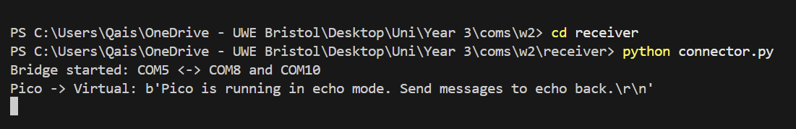
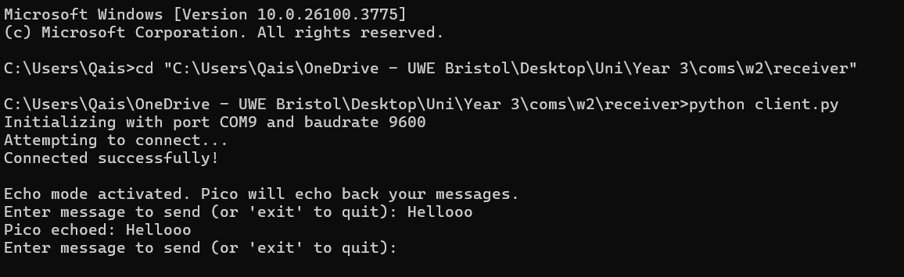
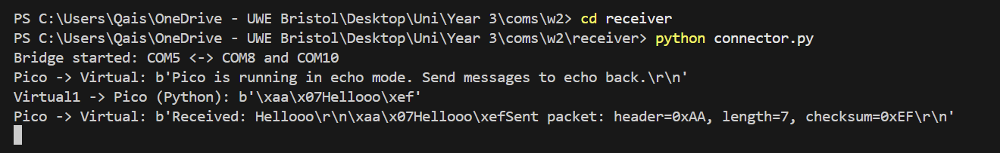
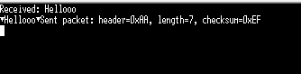

# Worksheet 2 - Custom Communication Protocol

## Table of Contents
- [Overview](#overview)
- [Getting Started](#getting-started)
  - [Essentials](#essentials)
  - [Initialising Project Environment](#initialising-project-environment)
    - [Cloning the pico SDK](#cloning-the-pico-sdk)
    - [Cloning and building the project](#cloning-and-building-the-project)
    - [Running the Project](#running-the-project)
- [File Structure](#file-structure)
- [Challenge Faced](#challenge-faced)
- [Implementation Details](#implementation-details)
  - [Pico Side](#pico-side)
    - [protocol.h](#protocolh)
    - [protocol.c](#protocolc)
    - [main.c](#mainc)
  - [PC Side](#pc-side)
    - [client.py](#clientpy)
- [Output](#output)


## Overview
This project implements a custom communication protocol between a Raspberry Pi Pico (developed in C) and a host PC application (developed in Python) utilising UART for data transmission. The system is designed to support robust and structured data transmission over USB Serial, enabling reliable communication for use cases like sensor data exchange, echo testing, and protocol validation.

## Getting Started
To get a copy of this project up and running on your local machine, follow these instructions.

## Essentials
* Raspberry Pi Pico SDK installed and configured
* CMake (>3.10)
* Make 
* USB connection to the Pico (For uploading .uf2 file)
* Pyserial for serial communication
* Virtual COM port tool to simulate serial bridges

## Initialising Project Environment
### Cloning the pico SDK
~~~bash
git clone -b master https://github.com/raspberrypi/pico-sdk.git
cd pico-sdk
git submodule update --init
~~~
Then set the environment variable so CMake can find it:
~~~bash
export PICO_SDK_PATH=/path/to/pico-sdk
~~~
Replace /path/to/pico-sdk with the actual path where you cloned it.

### Cloning and building the project
Clone the repository:
~~~bash
    git clone https://gitlab.uwe.ac.uk/q2-alhendi/worksheett2.git
~~~

To build and compile the C files follow these steps:
~~~bash
    mkdir build  # Create a build directory     
    cd build # navigate into build directory
    cmake .. # Generate build files 
    make # Compile project
~~~

### Running the Project
To run the project, follow these steps in order:
1. Hold the BOOTSEL button on the Raspberry Pi Pico and connect it to your computer via USB.
2. Open the build folder where the compiled .uf2 file is located.
3. Drag and drop the .uf2 file into the Pico's folder (which appears automatically).
4. Start the serial bridge (to route communication between the Pico and virtual COM ports)
~~~bash
python connector.py
~~~
5. Run
~~~bash
python client.py
~~~
6. Start sending messages in the terminal, you will see responses echoed back from the Pico.

You can also open Tera Term (or any serial terminal) on the second virtual COM port to observe communication live from a different tool.

### File Structure
**Hierarchical representation**
```bash
    Pico Side
    ├── protocol.c
    ├── protocol.h       
    ├── main.c   
    ├── CMakeLists.txt 
    ├── pico_sdk_import.cmake                  
```
```bash
    Python Side
    ├── client.py
    ├── connector.py       
```
## Challenge Faced
During testing, I encountered a common issue on Windows where accessing the same COM port with both a Python script and a serial terminal like Tera Term resulted in a "Permission Denied" or "Access Denied" error. To overcome this, I used Virtual Serial Port Driver Pro to create paired virtual COM ports. This allowed Python and Tera Term to communicate with the Pico simultaneously, enabling real-time debugging and verification during transmission.

## Implementation Details
### Pico Side
**protocol.h**: This is the header file for **protocol.c**.

**Snippet 1**:
```c
#define MAX_PACKET_SIZE 255
#define HEADER_BYTE 0xAA     
```
`MAX_PACKET_SIZE` defines the maximum number of bytes that can be included in the data payload of a packet. It is set to 255.

`HEADER_BYTE` is a special byte (0xAA) placed at the beginning of every packet to signal the start of a new message. It helps the receiver correctly identify and synchronize with incoming data.

**Snippet 2**:
~~~c
void protocol_init(void);
int protocol_connect(const char* address, int port);
int protocol_send(int connectionHandle, const void* data, int dataSize);
int protocol_receive(int connectionHandle, void* buffer, int bufferSize);
void protocol_disconnect(int connectionHandle);
void protocol_cleanup(void);
~~~
This snippet shows the declaration of all the functions.

**protocol.c**:
This file includes the core logic of the custom communication protocol on the Raspberry Pi Pico. It handles serial initialization, packet construction (including header, length, payload, and checksum), as well as receiving and validating incoming packets.

**Snippet 1**:
~~~c
void protocol_init(void) {
    if (!is_initialized) {
        stdio_init_all();
        while (!stdio_usb_connected()) {
            sleep_ms(100);
        }
        sleep_ms(1000);
        is_initialized = 1;
    }
}
~~~
The `protocol_init` function initializes the USB serial connection on the Raspberry Pi Pico. It ensures the communication interface is only set up once by checking a flag `is_initialized`. It waits until the USB is fully connected before proceeding, with a short delay to allow the host system to detect the device.

**Snippet 2**:
~~~c
int protocol_connect(const char* address, int port) {
    if (!is_initialized) {
        protocol_init();
    }
    return 1;
}
~~~
`protocol_connect` simply ensures that the protocol is initialized by calling `protocol_init` if connection is not initialised and then returns a dummy connection handle to simulate a successful connection.

**Snippet 3**:
~~~c
static uint8_t calculate_checksum(Packet* packet) {
    uint8_t checksum = 0;
    checksum ^= packet->header;
    checksum ^= packet->length;
    for (int i = 0; i < packet->length; i++) {
        checksum ^= packet->data[i];
    }
    return checksum;
}
~~~
This snippet demonstrates the `calculate_checksum` function which computes a simple XOR-based checksum to ensure data integrity in transmitted packets. It starts with a checksum value of 0, then sequentially XORs the packet's header, length, and each byte of the payload. This approach provides a lightweight method for basic error detection. Any change in the packet's contents during transmission will result in a different checksum, allowing the receiver to identify corrupted data.

**Snippet 4**:
~~~c
int protocol_send(int connectionHandle, const void* data, int dataSize) {
    if (dataSize > MAX_PACKET_SIZE || dataSize < 1) {
        printf("Send failed: Invalid dataSize %d\n", dataSize);
        return -1;
    }

    Packet packet;
    packet.header = HEADER_BYTE;             
    packet.length = (uint8_t)dataSize;      
    memcpy(packet.data, data, dataSize);      
    packet.checksum = calculate_checksum(&packet);

    uint8_t buffer[MAX_PACKET_SIZE + 3];
    buffer[0] = packet.header;
    buffer[1] = packet.length;
    memcpy(buffer + 2, packet.data, packet.length);
    buffer[2 + packet.length] = packet.checksum;

    for (int i = 0; i < packet.length + 3; i++) {
        int result = putchar_raw(buffer[i]);
        if (result == PICO_ERROR_TIMEOUT || result == PICO_ERROR_GENERIC) {
            printf("Transmission failed at byte %d\n", i);
            return -1;
        }
    }

    printf("Sent packet: header=0x%02X, length=%d, checksum=0x%02X\n", packet.header, packet.length, packet.checksum);
    return dataSize;
}
~~~
This snippet shows the `protocol_send` function which is responsible for creating and transmitting a complete packet over USB serial to the host PC. It first validates the payload size to ensure it's within allowed limits, then constructs the packet by assigning a header byte, setting the length, copying the payload data, and computing a checksum using the `calculate_checksum` function. Lastly it serialises the components into a byte buffer and uses `putchur_raw` it send them one by one. If transmission fails at any point, it returns an error; otherwise, it prints debug information and returns the number of payload bytes successfully sent.

**Snippet 5**:
~~~c
int protocol_receive(int connectionHandle, void* buffer, int bufferSize) {
    if (bufferSize <= 0) {
        printf("Receive failed: Invalid bufferSize %d\n", bufferSize);
        return -1;
    }

    Packet packet;
    uint32_t start_time = time_us_32();

    packet.header = getchar_timeout_us(5000000);
    if (packet.header != HEADER_BYTE) {
        return -1;
    }

    packet.length = getchar_timeout_us(5000000);
    if (packet.length > MAX_PACKET_SIZE || packet.length > bufferSize) {
        printf("Invalid length: %d\n", packet.length);
        return -1;
    }

    for (int i = 0; i < packet.length; i++) {
        if ((time_us_32() - start_time) / 1000000 > 10) {
            printf("Timeout receiving packet data\n");
            return -1;
        }
        packet.data[i] = getchar_timeout_us(5000000);
    }

    if ((time_us_32() - start_time) / 1000000 > 10) {
        printf("Timeout receiving checksum\n");
        return -1;
    }
    packet.checksum = getchar_timeout_us(5000000);

    if (calculate_checksum(&packet) != packet.checksum) {
        printf("Checksum mismatch\n");
        return -1;
    }
    memcpy(buffer, packet.data, packet.length);
    return packet.length; 
}
~~~
The `protocol_receive` function handles receiving and validating a packet from the USB serial interface. It starts by checking if the provided buffer size is valid, then waits for a valid header byte to identify the beginning of a packet. Once the header is found, it reads the payload length, ensures it doesn't exceed the buffer or maximum allowed size, and proceeds to read the actual data bytes followed by a checksum byte. A timeout mechanism is used throughout to prevent the system from hanging if data isn't received in time. After reading, it verifies the integrity of the packet using a checksum; if valid, it copies the payload into the buffer and returns the number of bytes received, otherwise it displays an error.

**Snippet 6**:
~~~c
void protocol_disconnect(int connectionHandle) {
}

void protocol_cleanup(void) {
    is_initialized = 0;
}
~~~
This final snippet for **protocol.c** shows these two functions which serve as placeholders to maintain the structure and flexibility of the protocol's API, even though their functionality is minimal in a USB serial context. The `protocol_disconnect` function is included to represent the termination of a connection, but since USB serial communication on the Raspberry Pi Pico doesn’t require explicit disconnection (the host handles it automatically), the function is left empty. On the other hand, `protocol_cleanup` provides a basic cleanup mechanism by resetting the is_initialized flag to 0. This allows the protocol to be reinitialized later if needed, offering a soft reset capability without restarting the device.

**main.c**: This file is basically the main function file where the process is initiated.

**Snippet**:
~~~c
int main() {
    protocol_init();
    int conn = protocol_connect(NULL, 0);
    char buffer[256];

    printf("Pico is running in echo mode. Send messages to echo back.\n");

    while (1) {
        int bytes_received = protocol_receive(conn, buffer, sizeof(buffer));
        if (bytes_received > 0) {
            buffer[bytes_received] = '\0';
            printf("Received: %s\n", buffer);
            protocol_send(conn, buffer, bytes_received);
        }
    }

    protocol_disconnect(conn);
    protocol_cleanup();
    return 0;
}
~~~
This `main` function sets up and runs a continuous echo server on the Raspberry Pi Pico using the custom communication protocol. It begins by initializing the USB serial interface via `protocol_init` and simulates a connection with `protocol_connect`. A buffer of 256 bytes is allocated to hold incoming data. Inside the infinite loop, the Pico waits for incoming packets using `protocol_receive`, prints the received message to the console, and then immediately echoes it back using `protocol_send`. If a valid packet is received (i.e., bytes_received > 0), the data is null-terminated for safe string printing. Although `protocol_disconnect` and `protocol_cleanup` are placed after the loop, they aren’t reached unless the loop is interrupted, reflecting good practice for structured cleanup. This setup makes the Pico act as a passive responder that acknowledges and and sends back every valid message received.

### PC Side
**client.py**: This Python file implements the PC-side of a custom serial communication protocol. It sends user-input messages to the Raspberry Pi Pico and displays the echoed responses in realtime.

**Snippet 1**:
~~~py
class CustomProtocol:
    HEADER_BYTE = 0xAA 

    def __init__(self, port='COM9', baudrate=9600):
        self.port = port      
        self.baudrate = baudrate    
        self.serial = None          
        self.running = False      
        self.last_received = None        
        print(f"Initializing with port {self.port} and baudrate {self.baudrate}")
~~~
This is the constructor and class definition for `CustomProtocol`, which sets up a serial communication protocol for talking to the Raspberry Pi Pico. The `HEADER_BYTE` `0xAA` marks the start of each packet. The constructor initializes the serial port settings such as the COM port `COM9` by default and baud rate `9600`. It also defines internal attributes like `self.serial` to hold the connection, `self.running` to track the connection status, and `self.last_received` for storing the last received message. A print statement confirms the port and baud rate being used.

**Snippet 2**:
~~~py
def _calculate_checksum(self, data, length):
        checksum = self.HEADER_BYTE ^ length
        for byte in data[:length]:
            checksum ^= byte
        return checksum
~~~
The `_calculate_checksum` function generates a simple XOR-based checksum for a packet to ensure data integrity. It starts by XORing the `HEADER_BYTE` with the payload `length`, then continues XORing each byte of the actual data. The final result is returned as the checksum, which is later used to detect errors during transmission or reception. 

**Snippet 3**:
~~~py
def send(self, data):
        if not self.serial or not self.serial.is_open:
            print("Serial port not open!")
            return False
        packet = bytearray([self.HEADER_BYTE, len(data)]) + data
        checksum = self._calculate_checksum(data, len(data))
        packet.append(checksum)
        self.serial.write(packet)
        self.serial.flush()
        return True
~~~
The `send` function in the `CustomProtocol` class is responsible for constructing and transmitting a properly formatted packet to the Raspberry Pi Pico. It first checks if the serial port is open, if not it returns an error. It then builds the packet by combining the header byte , the length of the data, the actual data itself, and a checksum. Once the packet is assembled, it writes the complete byte stream to the serial port and flushes the output buffer to ensure it's sent immediately.

**Snippet 4**:
~~~py
def receive(self, buffer_size):
        if not self.serial or not self.serial.is_open:
            return None

        while True:
            header = self.serial.read(1)  
            if len(header) == 0:
                return None
            if header[0] != self.HEADER_BYTE:
                continue  

            length_bytes = self.serial.read(1)
            if len(length_bytes) == 0:
                return None
            length = length_bytes[0]

            if length > buffer_size:
                continue

            data = self.serial.read(length)     
            checksum = self.serial.read(1)    
            if len(data) != length or len(checksum) != 1:
                continue  

            if self._calculate_checksum(data, length) != checksum[0]:
                continue 

            return data  
~~~
The `receive` function handles incoming packets from the serial port, ensuring that each one is valid and correctly formatted before passing the data to the program. It starts by checking if the serial port is open, then continuously listens for incoming data. It waits for a specific `HEADER_BYTE` `0xAA` to identify the start of a packet. Once found, it reads the next byte to determine the expected length of the payload. If the length exceeds the allowed buffer size, it skips the packet. Then, it reads the actual payload followed by a checksum byte. The checksum is verified using the `_calculate_checksum` function to ensure the data hasn’t been corrupted. If all checks pass, the function returns the valid data. Otherwise, it keeps listening until a correct packet is received.

**Snippet 5**:
~~~py
if __name__ == "__main__":

    protocol = CustomProtocol('COM9', 9600)

    if protocol.connect():
        try:
            time.sleep(2)  
            print("\nEcho mode activated. Pico will echo back your messages.")
           
            while True:
                user_message = input("Enter message to send (or 'exit' to quit): ").strip()
                if user_message.lower() == 'exit':
                    break 
                if not user_message:
                    continue 
                protocol.send(user_message.encode())

                response = protocol.receive(255)
                if response:
                    print("Pico echoed:", response.decode(errors='ignore'))
                else:
                    print("No valid response received.")
        except KeyboardInterrupt:
            print("\nExiting on user interrupt...")
        finally:
            protocol.cleanup()
    else:
        print("Failed to initialize protocol.")

~~~
This block runs the script when it is executed directly. It starts by creating a `CustomProtocol` instance configured for `COM9` at 9600 baud. It attempts to connect to the Raspberry Pi Pico using `protocol.connect()`. If the connection succeeds, it enters a loop that lets the user type messages to send to the Pico. Each message is encoded and sent, and the script waits for a response using the `receive()` method. If a response is received and passes checksum validation, it is printed to the console. The loop continues until the user types `'exit'` or interrupts the program, at which point the script cleans up by closing the serial port. 

**connector.py**: This Python file acts as a serial bridge between the Raspberry Pi Pico and two virtual COM ports. The main role of it is to allow simultaneous communication between the Pico, a Python script (like client.py), and a serial monitoring tool (like Tera Term).

**Snippet 1**:
~~~py
pico_port = 'COM5'       
virtual_port1 = 'COM8'   
virtual_port2 = 'COM10'  
~~~
`pico_port` is the actual hardware serial port your Raspberry Pi Pico is connected to via USB. It’s where all real data is sent or received.

`virtual_port1` is a software-created virtual serial port. It’s the endpoint your Python script (client.py) connects to for reading from or writing to the Pico indirectly.

`virtual_port2` is another virtual port, opened by a tool like Tera Term for live monitoring.

**Snippet 2**:
~~~py
def connect_port(port, baudrate):
    max_attempts = 3 
    for attempt in range(max_attempts):
        try:
            ser = serial.Serial(port, baudrate, timeout=1)
            ser.flushInput()   
            ser.flushOutput()  
            return ser
        except serial.SerialException as e:
            print(f"Failed to connect to {port} (attempt {attempt + 1}/{max_attempts}): {e}")
            time.sleep(1)  
    raise serial.SerialException(f"Could not connect to {port} after {max_attempts} attempts")
~~~
The `connect_port` function is responsible for reliably establishing a serial connection to a specified `port` using a defined `baudrate`. It uses a retry mechanism controlled by `max_attempts`, which limits the number of connection attempts to 3. Inside the loop, it tries to create a `serial.Serial` object called `ser` that represents the the serial connection, while setting a 1 second timeout for responsiveness. After successfully opening the port, it flushes both the input and output buffers (`flushInput()` and `flushOutput()`) to prevent any residual data from interfering with the communication. If the port fails to open during any of the attempts, it prints a helpful error message and waits one second (`time.sleep(1)`) before retrying. If all attempts fail, it raises a `SerialException` to notify the rest of the program that the port could not be connected.

**Snippet 3**:
~~~py
try:
    pico = connect_port(pico_port, 9600)
    virtual1 = connect_port(virtual_port1, 9600)
    virtual2 = connect_port(virtual_port2, 9600)
    print(f"Bridge started: {pico_port} <-> {virtual_port1} and {virtual_port2}")
except serial.SerialException as e:
    print(f"Error opening ports: {e}")
    exit(1)
~~~
This block of code attempts to establish serial connections to three different ports: the physical Raspberry Pi Pico port `COM5`, and two virtual ports `virtual_port1` and `virtual_port2` using the `connect_port` function. All connections are initialized at a baud rate of `9600`.

**Snippet 4**:
~~~py
try:
    while True:
        try:
            if pico.in_waiting:
                data = pico.read(min(pico.in_waiting, 1024))  
                virtual1.write(data)
                virtual2.write(data)
                virtual1.flush()
                virtual2.flush()
                print(f"Pico -> Virtual: {data}")

            if virtual1.in_waiting:
                data = virtual1.read(min(virtual1.in_waiting, 1024))
                pico.write(data)
                pico.flush()
                print(f"Virtual1 -> Pico (Python): {data}")

            if virtual2.in_waiting:
                data = virtual2.read(min(virtual2.in_waiting, 1024))
                pico.write(data)
                pico.flush()
                print(f"Virtual2 -> Pico (Tera Term): {data}")

            time.sleep(0.01) 
        except serial.SerialException as e:
            print(f"Serial error: {e}")
            time.sleep(1)
~~~
This `while True` loop continuously bridges communication between the Raspberry Pi Pico and two virtual COM ports. It acts as a transparent relay, allowing data from the Pico to be forwarded to both the Python app (via virtual1) and a serial monitor like Tera Term (via virtual2). If the Pico sends data (checked using pico.in_waiting), the data is read, duplicated, and sent to both virtual ports, then flushed. Conversely, if either of the virtual ports sends data, it is forwarded to the Pico. This enables real-time two-way communication.

**Snippet 5**:
~~~py
except KeyboardInterrupt:
    print("\nStopping bridge...")
~~~
This triggers the print message when the terminal is shut down by CTRL+C.

### Output
The output of running **connector.py**


The output of running **client.py** and sending message "Hellooo"


The output of **connector.py** after sending the message


The putput of the Tera Term terminal 



